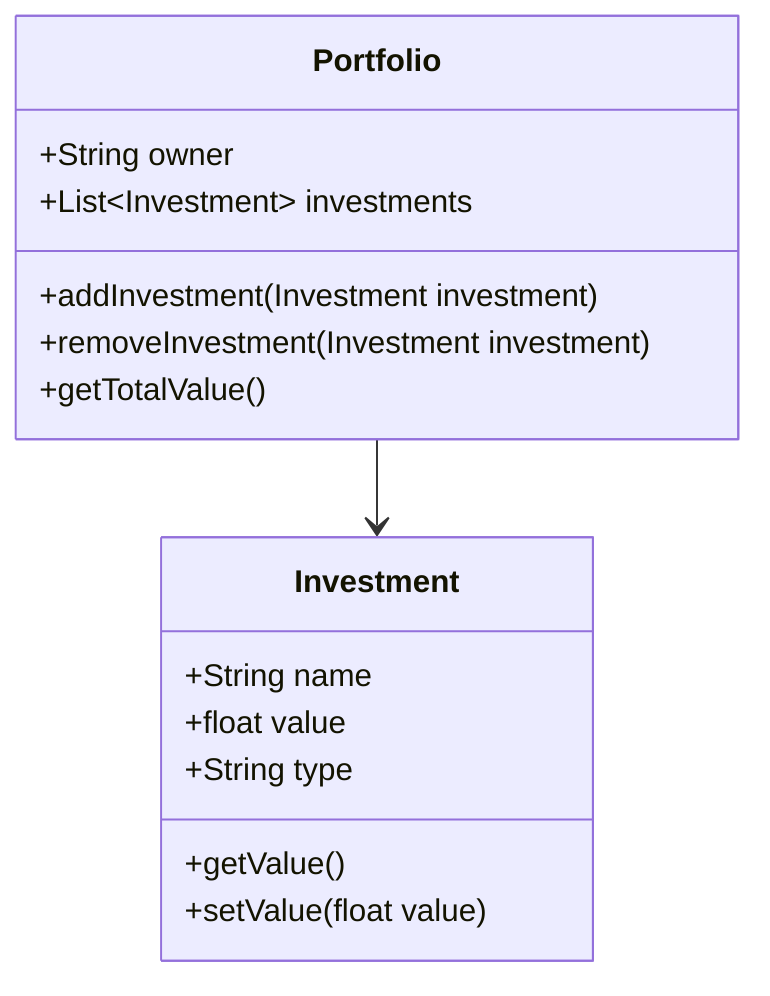

# agr-inv
Agregador de investimentos - Playlist do Canal Build &amp; Run

## Videos
- [`ADI 1` - Criando um CRUD com Java Spring Boot e MySQL](https://www.youtube.com/watch?v=Tnl4YnB6E54&list=PLxCh3SsamNs62j6T7bv6f1_1j9H9pEzkC) -

    - [Spring Initi](https://start.spring.io/)

## Diagrama

